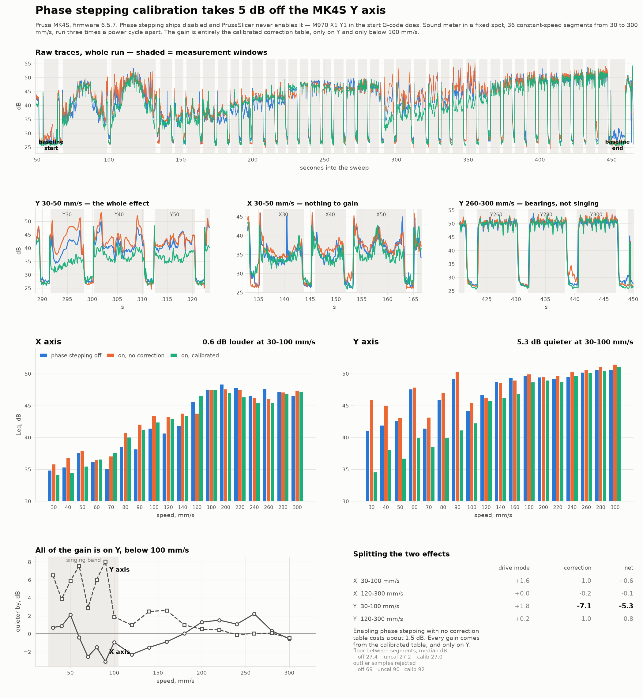

# MK4S noise sweep

My Prusa MK4S sang — a loud tone that changed pitch with speed, worst on Y. This
is the G-code I used to measure it and the scripts that turn a phone recording
into numbers.

It turned out **phase stepping is switched off by default on the MK4S**, and
PrusaSlicer never turns it on. Calibrating it and enabling it took **5 dB off
the Y axis** below 100 mm/s.



## The fix

Run Phase Stepping Calibration (needs the accelerometer), then put this at the
end of your start G-code, after `G28`:

```
M970 X1 Y1 ; enable phase stepping - resets every boot
```

Calibrate *first*. Turning it on without a calibrated table made things about
1.5 dB worse. All of the gain is in the table, not the drive mode.

It only helped Y, and only below 100 mm/s. Above that it's bearing noise, which
no amount of motor tuning touches.

The default is in the firmware: `defaults.hpp` sets `phase_stepping_enabled` to
`true` for the XL, CORE One and iX, and `false` for MK4/MK3.5/MINI. The flag is
`ram_only`, so it goes back to off at every power cycle.

## Try it

```sh
./make_gcode.sh
```

Copy `gcode/mk4s_ab_phase.gcode` to a USB stick and print it — 3½ minutes, each
speed twice, phase stepping off then on. Low beep before the off pass, high beep
before the on pass. You can just listen; the ear catches a tone better than a dB
meter does.

To measure properly, print `mk4s_sweep_phase_off.gcode` and
`mk4s_sweep_phase_on.gcode` with a phone recording dB in a fixed spot, then:

```sh
./plot_results.py off.csv on.csv \
    --schedule gcode/mk4s_sweep_phase_on_schedule.csv -o out.png
```

Nothing heats or extrudes — it just moves X and Y at a list of fixed speeds.
**Power cycle before every run**, or you won't know what state you measured: a
PrusaSlicer print leaves input shaping off, and the phase stepping flag resets
on boot anyway.

## What's in here

| | |
|---|---|
| `gen_noise_sweep.py` | makes the G-code, `--help` for options |
| `plot_states.py` | three-way comparison, makes the picture above |
| `plot_results.py` | simple two-run before/after |
| `plot_alignment.py` | checks two recordings line up |
| `printer_console.py` | send G-code over USB, read the reply |
| `recordings/` `results/` | my three runs and what came out of them |

Each G-code file writes a `_schedule.csv` listing every segment. The scripts
line your recording up against it automatically, so it doesn't matter when you
hit record.

## Caveats

A phone in a hobby room, not a lab. Absolute dB means nothing here — only
differences between runs with the phone in the same place. Anything under about
1 dB is noise.

Made for an MK4S. Other Buddy printers need the limits changed in
`gen_noise_sweep.py`.

## License

Public domain (Unlicense) - do whatever you want with it.
